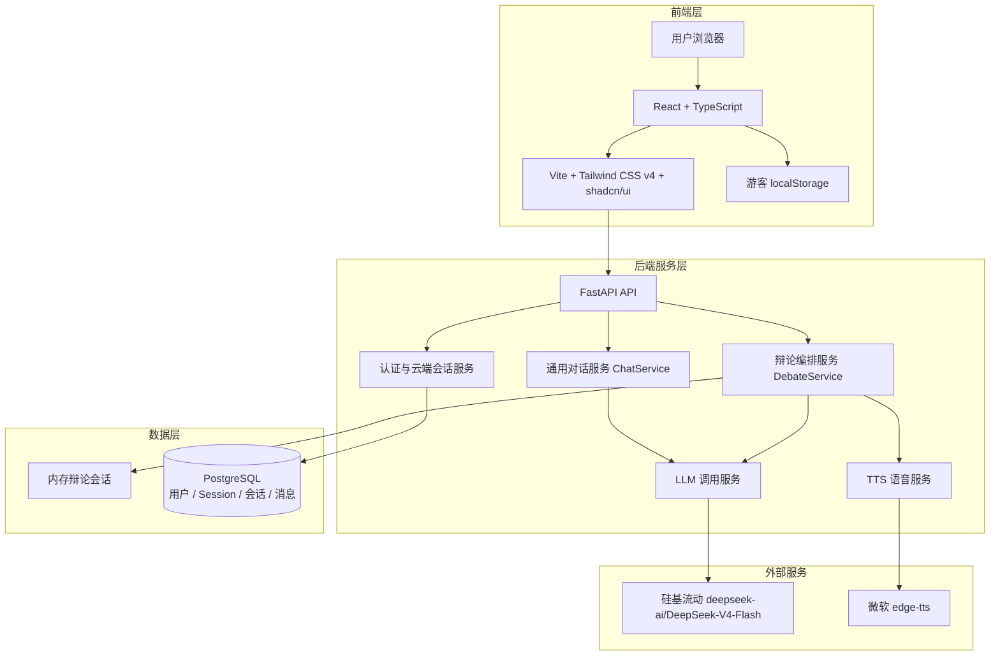

# Cyber Foodie Debate - AI校园干饭辩论赛与美食擂台

[](https://github.com/wez798/cyber-foodie-debate/actions)
[](https://www.python.org/downloads/)
[](https://opensource.org/licenses/MIT)

> 🍔 川辣派 vs 粤式养生派 — 让两个AI大厨为你辩论今天吃什么！

## 系统架构图



## 快速启动

### 1. 环境准备

- Python 3.11
- Node.js 22.13+（或 24+）
- pnpm

```bash
# 克隆仓库
git clone https://github.com/wez798/cyber-foodie-debate.git
cd cyber-foodie-debate

# 复制环境变量模板
cp .env.example .env
# 编辑 .env 填入硅基流动 API Key
```

对话功能所需的配置如下，API Key 只保存在本地 `.env`，不要提交到仓库：

```dotenv
SILICONFLOW_API_KEY=your_siliconflow_api_key_here
SILICONFLOW_BASE_URL=https://api.siliconflow.cn/v1
SILICONFLOW_MODEL=deepseek-ai/DeepSeek-V4-Flash
SILICONFLOW_MAX_REQUESTS_PER_MINUTE=60
SILICONFLOW_MAX_CONCURRENCY=4
```

### 2. 本地开发启动

```bash
# 安装后端依赖
pip install -r src/backend/requirements.txt

# 创建数据库并执行迁移（DATABASE_URL 取自 .env）
alembic upgrade head

# 启动后端服务
python -m src.backend.main
```

另开终端启动前端：

```bash
cd src/frontend
pnpm install --frozen-lockfile
pnpm dev
```

前端辩论接口默认访问 `http://localhost:8000/api/v1`，聊天接口默认访问
`http://localhost:8000/api`。如后端地址不同，可分别设置
`VITE_API_BASE_URL` 和 `VITE_CHAT_API_BASE_URL`。未覆盖时，开发前端会使用当前页面的
协议与主机名连接其 `8000` 端口，避免 `localhost` 与 `127.0.0.1` 混用导致 Cookie
失效。建议在
`src/frontend/.env.local` 中保存本地前端配置；任何 `VITE_*` 变量都会进入浏览器包，
不得放入 API Key 或其他敏感信息。

访问 http://localhost:5173 使用前端，访问 http://localhost:8000/docs 查看 API 文档。

### 3. Docker Compose 一键启动

```bash
docker compose up --build
```

Compose 要求先在 `.env` 中设置 `POSTGRES_PASSWORD`。生产 HTTPS 部署还必须设置
`SESSION_COOKIE_SECURE=true`，并把 `FRONTEND_ORIGINS` 改为实际前端来源的 JSON 数组；
这两个值会由 Compose 原样传给后端，不需要修改编排文件。

访问 http://localhost:3000 使用前端，访问 http://localhost:8000/docs 查看 API 文档。
前端镜像通过 pnpm 构建 Vite 产物，并由 Nginx 托管；`/chat`、`/debate` 支持直接访问
和刷新，`/api/` 由 Nginx 反向代理到 FastAPI。后端容器的存活检查只访问轻量根接口，
不会周期性调用 LLM 或 TTS。Nginx 对认证入口和其余 API 分别实施按 IP 限流；若前面
还有反向代理，应同时配置可信真实客户端 IP 传递规则。

## 项目结构

```
cyber-foodie-debate/
├── .github/
│   ├── workflows/ci.yml         # GitHub Actions CI 流水线
│   ├── ISSUE_TEMPLATE/          # Issue 模板
│   └── PULL_REQUEST_TEMPLATE.md # PR 审查模板
├── docs/
│   ├── system_design.md         # 系统架构设计（6大架构图）
│   ├── user_stories/            # User Story 文档集
│   └── sprint{1-4}_report.md    # Sprint 迭代报告
├── src/
│   ├── backend/                 # FastAPI 后端服务
│   │   ├── api/                 # API 路由层
│   │   ├── repositories/        # SQLAlchemy 数据访问层
│   │   ├── services/            # 业务逻辑层
│   │   ├── db_models.py         # SQLAlchemy 持久化实体
│   │   ├── models.py            # Pydantic 数据模型
│   │   ├── config.py            # 配置管理
│   │   └── app.py               # 应用工厂
│   └── frontend/                # React + TypeScript 独立前端应用
│       ├── src/
│       │   ├── components/ui/   # shadcn/ui 基础组件
│       │   ├── features/chat/   # 自由聊页面、状态、本地存储与 API
│       │   ├── features/debate/ # 辩论页面、状态与 API 逻辑
│       │   ├── lib/sse.ts       # POST SSE 流解析器
│       │   └── types/           # 聊天与辩论领域类型
│       ├── Dockerfile            # Vite 构建 + Nginx 运行镜像
│       ├── nginx.conf            # SPA 回退与 /api/ 反向代理
│       ├── package.json
│       └── vite.config.ts
├── tests/
│   ├── unit/                    # 单元测试
│   ├── integration/             # 认证与数据库集成测试
│   └── bdd/features/            # BDD 验收测试
├── alembic/                     # 数据库迁移
├── eval/                        # 评测数据集
├── .env.example                 # 环境变量模板
├── Dockerfile                   # FastAPI 后端镜像
├── docker-compose.yml           # 编排启动
├── AGENTS.md                    # AI 规则注入
└── README.md                    # 本文件
```

## 核心功能

| 功能           | 描述                    | 状态        |
| -------------- | ----------------------- | ----------- |
| 饮食偏好输入   | 口味/预算/天气/忌口     | ✅ MVP      |
| 双Agent辩论    | 川辣派 vs 粤式养生派    | ✅ MVP      |
| 辩论结果判定   | 自动判定获胜方+推荐菜品 | ✅ MVP      |
| 流式响应       | POST SSE 实时辩论直播   | ✅ MVP      |
| 双页面交互     | 自由聊与辩论赛独立切换  | ✅ MVP      |
| 自由聊推荐     | 推荐能力内置且 Prompt 模式不可见 | ✅ MVP |
| 对话历史       | 游客本地保存；登录用户云端分页持久化 | ✅ MVP  |
| TTS语音播报    | 微软TTS朗读辩论结果     | ✅ MVP      |
| 后端对话持久化 | PostgreSQL + Alembic，支持中断终态与幂等重放 | ✅ MVP |
| GitHub API集成 | 自动获取commit生成梗图  | ❌ 规划中   |

## API 文档

启动服务后访问 http://localhost:8000/docs 查看交互式 API 文档（Swagger UI）。

### 核心接口

| 方法 | 路径                            | 描述     |
| ---- | ------------------------------- | -------- |
| GET  | `/api/v1/health`              | 健康检查 |
| POST | `/api/chat`                   | 非流式对话兜底 |
| POST | `/api/chat/stream`            | POST SSE 流式对话 |
| POST | `/api/v1/auth/register`       | 注册并创建安全会话 |
| POST | `/api/v1/auth/login`          | 登录并创建安全会话 |
| POST | `/api/v1/auth/logout`         | 撤销当前会话 |
| GET  | `/api/v1/auth/me`             | 获取当前用户 |
| GET/POST | `/api/v1/conversations` | 分页查询/创建云端会话 |
| POST | `/api/v1/conversations/import` | 用户确认后幂等导入游客完整问答 |
| GET/PATCH/DELETE | `/api/v1/conversations/{id}` | 查询、更新或软删除会话 |
| GET  | `/api/v1/conversations/{id}/messages` | 分页查询持久化消息 |
| POST | `/api/v1/conversations/{id}/messages/stream` | 持久化 POST SSE 对话 |
| POST | `/api/v1/debate/start`        | 启动辩论 |
| POST | `/api/v1/debate/start-stream` | 流式启动三轮辩论 |
| GET  | `/api/v1/debate/{session_id}` | 查询会话 |
| POST | `/api/v1/tts/synthesize-debate-result` | 合成辩论结果语音 |

### 对话请求

`POST /api/chat` 与 `POST /api/chat/stream` 使用相同请求体。最后一条消息必须是
`user`，客户端不能提交 `system` 角色：

```json
{
  "conversation_id": null,
  "messages": [
    {"role": "user", "content": "预算 20 元，午饭吃什么？"}
  ],
  "mode": "recommend",
  "topic": "校园午饭",
  "metadata": {"client": "web"}
}
```

`mode` 可取 `chat`、`debate_pro`、`debate_con`、`judge`、`recommend`。
这些模式属于后端扩展能力；当前前端自由聊固定使用 `chat`，推荐能力已合并其中，
正反方和主持裁决则由独立的辩论页面负责，不向用户展示 Prompt 模式切换。
流式接口依次发送 `start`、多个 `delta`、`done` SSE 事件；若响应头已发出后
上游失败，则发送 `error` 事件。当前聊天响应中的 `tts.status` 固定为
`not_requested`，仅作为下一步接入 edge-tts 的扩展点。

辩论流依次发送 `session_start`、多个 `round`、`result`；只有有效裁决才会发送
`result`。上游失败或整体超时时发送结构化 `error`，客户端不得把它显示为完成。
后端通过环境变量限制 SiliconFlow 每分钟请求数与进程内并发数。

前端通过顶部“功能页面”选择器在 `/chat` 与 `/debate` 之间切换。AI 回复会经过
安全的 Markdown 组件渲染，不会直接显示加粗、列表等 Markdown 源标记。

游客聊天历史只保存在浏览器 localStorage，键为
`cyber-foodie-debate:recent-chat`。登录后，前端改用受认证与 CSRF 保护的云端接口，
消息写入 PostgreSQL，打开会话时仅加载最近 50 条消息；点击顶部“加载更早消息”才请求上一页。
失败保留已显示内容，可重试当前页，会话列表继续支持“加载更多”。密码使用 Argon2id；浏览器
只持有 HttpOnly 不透明会话 Cookie 和可读的 CSRF Cookie，数据库仅保存令牌哈希。

## 本地历史导入

登录后，本地历史旁会显示消息数量、纯文本摘要和“保存当前本地会话”。只有主动点击才会上传，
超出限制会说明原因，不截断。可“暂不保存”继续云端聊天，也可取消正在进行的保存。
导入 ID 由当前用户与完整本地快照的 SHA-256 确定，网络失败或刷新后未变化的快照复用同一 ID，
无需另存认证信息。需要 HTTPS 或 localhost 的 Web Crypto 支持。

成功响应经运行时校验，再读取云端会话与有界消息页，核对导入的角色、正文、顺序、来源和状态，
打开云端会话并刷新列表。全部确认后，仅在本地快照仍相同时清理副本；清理同步更新游客内存。
所有本地写入与清理共用 Web Locks 跨标签页锁；浏览器不支持锁、内容已变化、读取失败或取消，
均保留本地数据。旧导入会话若已追加大量消息、最近页不能核对全部原消息，也保留副本并说明原因。
账号切换、登出或卸载会取消请求，旧响应不会导航或清理。密码和认证 Token 不存 localStorage。

### API 契约

`POST /api/v1/conversations/import` 使用登录 Cookie、允许的 Origin 和 CSRF 保护，
返回 `200 ConversationResponse`。请求仅接受 `import_request_id`（1–64 字符，
`[A-Za-z0-9][A-Za-z0-9._:-]*`）、可空 `topic`（去除首尾空白后最多 200 字符）和
`messages`（1–50 条，仅 `role` 与 `content`）。消息只能为 user/assistant，必须有
user，可结束于 assistant；每条正文 1–8000 字符且不能纯空白，正文原样保存，
正文与规范化 topic 合计最多 64000 Unicode 字符。未知字段返回 422。

同一用户相同 ID 和内容返回原会话；不同内容返回 `409 import_conflict`，
原会话软删除后返回 `409 import_deleted`，不恢复或重复创建。不同用户的 ID 独立。
导入为 chat，消息标记 `client_import/complete`，按请求顺序编号；全过程不调用 LLM/TTS。
部署前在目标开发数据库执行 `alembic upgrade head`；新迁移为 `20260908_0002`，
随后执行 `alembic check`。本阶段不含 OAuth、邮件验证、密码找回或辩论持久化。

## 技术栈

- **LLM**: 硅基流动 `deepseek-ai/DeepSeek-V4-Flash`
- **后端**: Python 3.11 / FastAPI / Pydantic v2
- **前端**: React 19 / TypeScript / Vite
- **UI**: Tailwind CSS v4 / shadcn/ui / Lucide React
- **TTS**: Microsoft edge-tts
- **测试**: pytest / behave (BDD) / Vitest / Testing Library
- **CI/CD**: GitHub Actions
- **容器**: Docker / Docker Compose

更完整的前后端分层、数据流、状态机和 SSE 时序见
[`docs/system_design.md`](docs/system_design.md)。

## 前端质量检查

在 `src/frontend` 目录执行：

```bash
pnpm test
pnpm typecheck
pnpm build
```

后端质量检查与完整贡献流程见 [`CONTRIBUTING.md`](CONTRIBUTING.md)。

## 团队与贡献

| 角色          | 成员 | 职责                    |
| ------------- | ---- | ----------------------- |
| Product Owner | -    | 需求优先级、Backlog管理 |
| Scrum Master  | -    | 敏捷流程、障碍清除      |
| Developer     | -    | 全栈开发                |
| Developer     | -    | 全栈开发                |
| Developer     | -    | 全栈开发                |

## License

MIT License - 本项目为工程实训教学用途。
