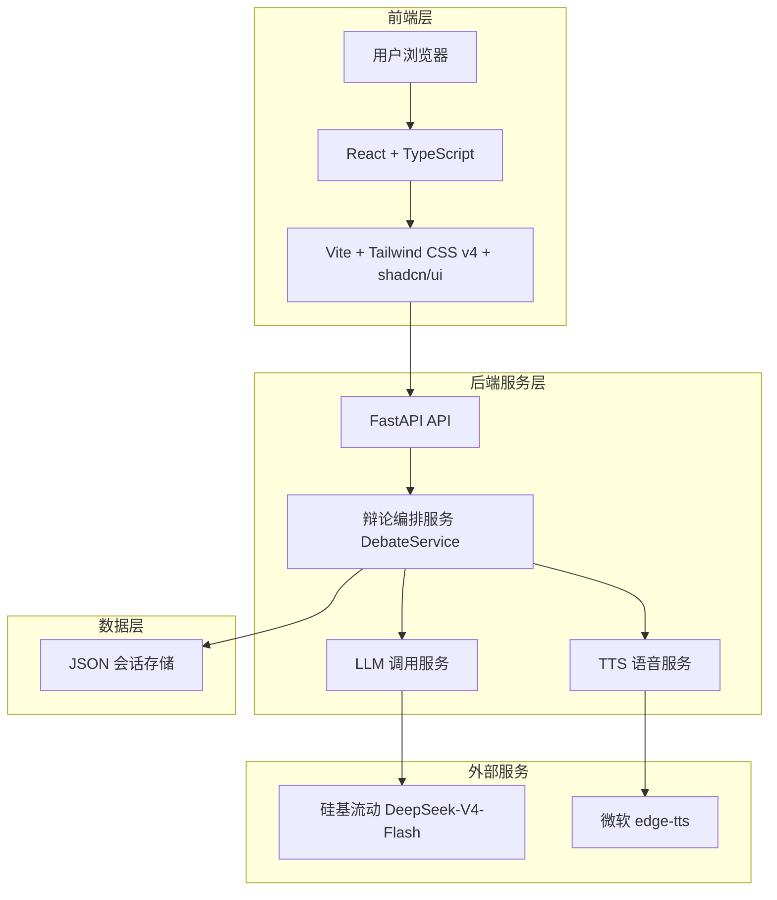

# Cyber Foodie Debate - AI校园干饭辩论赛与美食擂台

[](https://github.com/wez798/cyber-foodie-debate/actions)
[](https://www.python.org/downloads/)
[](https://opensource.org/licenses/MIT)

> 🍔 川辣派 vs 粤式养生派 — 让两个AI大厨为你辩论今天吃什么！

## 系统架构图



## 快速启动

### 1. 环境准备

```bash
# 克隆仓库
git clone https://github.com/wez798/cyber-foodie-debate.git
cd cyber-foodie-debate

# 复制环境变量模板
cp .env.example .env
# 编辑 .env 填入硅基流动 API Key
```

### 2. 本地开发启动

```bash
# 安装后端依赖
pip install -r src/backend/requirements.txt

# 启动后端服务
python -m src.backend.main
```

另开终端启动前端：

```bash
cd src/frontend
pnpm install
pnpm dev
```

前端默认访问 `http://localhost:8000/api/v1`。如后端地址不同，可在启动前设置
`VITE_API_BASE_URL`。

访问 http://localhost:5173 使用前端，访问 http://localhost:8000/docs 查看 API 文档。

### 3. Docker 一键启动

```bash
docker-compose up --build
```

当前 Docker 配置尚未接入 Vite 前端构建流程。本地前端开发请使用 `pnpm dev`，Docker
适配将在后续变更中单独完成。

## 项目结构

```
cyber-foodie-debate/
├── .github/
│   ├── workflows/ci.yml         # GitHub Actions CI 流水线
│   ├── ISSUE_TEMPLATE/          # Issue 模板
│   └── PULL_REQUEST_TEMPLATE.md # PR 审查模板
├── docs/
│   ├── system_design.md         # 系统架构设计（6大架构图）
│   ├── user_stories/            # User Story 文档集
│   └── sprint{1-4}_report.md    # Sprint 迭代报告
├── src/
│   ├── backend/                 # FastAPI 后端服务
│   │   ├── api/                 # API 路由层
│   │   ├── services/            # 业务逻辑层
│   │   ├── models.py            # Pydantic 数据模型
│   │   ├── config.py            # 配置管理
│   │   └── app.py               # 应用工厂
│   └── frontend/                # React + TypeScript 独立前端应用
│       ├── src/
│       │   ├── components/ui/   # shadcn/ui 基础组件
│       │   ├── features/debate/ # 辩论页面、状态与 API 逻辑
│       │   ├── lib/sse.ts       # POST SSE 流解析器
│       │   └── types/debate.ts  # 辩论领域类型
│       ├── package.json
│       └── vite.config.ts
├── tests/
│   ├── unit/                    # 单元测试
│   └── bdd/features/            # BDD 验收测试
├── eval/                        # 评测数据集
├── .env.example                 # 环境变量模板
├── Dockerfile                   # 容器化封装
├── docker-compose.yml           # 编排启动
├── AGENTS.md                    # AI 规则注入
└── README.md                    # 本文件
```

## 核心功能

| 功能           | 描述                    | 状态        |
| -------------- | ----------------------- | ----------- |
| 饮食偏好输入   | 口味/预算/天气/忌口     | ✅ MVP      |
| 双Agent辩论    | 川辣派 vs 粤式养生派    | ✅ MVP      |
| 辩论结果判定   | 自动判定获胜方+推荐菜品 | ✅ MVP      |
| 流式响应       | POST SSE 实时辩论直播   | ✅ MVP      |
| TTS语音播报    | 微软TTS朗读辩论结果     | ✅ MVP      |
| 历史记录       | 辩论会话持久化          | 🔄 Sprint 3 |
| GitHub API集成 | 自动获取commit生成梗图  | ❌ 规划中   |

## API 文档

启动服务后访问 http://localhost:8000/docs 查看交互式 API 文档（Swagger UI）。

### 核心接口

| 方法 | 路径                            | 描述     |
| ---- | ------------------------------- | -------- |
| GET  | `/health`                     | 健康检查 |
| POST | `/api/v1/debate/start`        | 启动辩论 |
| POST | `/api/v1/debate/start-stream` | 流式启动三轮辩论 |
| GET  | `/api/v1/debate/{session_id}` | 查询会话 |
| POST | `/api/v1/tts/synthesize-debate-result` | 合成辩论结果语音 |

## 技术栈

- **LLM**: 硅基流动 DeepSeek-V4-Flash
- **后端**: Python 3.11 / FastAPI / Pydantic v2
- **前端**: React 19 / TypeScript / Vite
- **UI**: Tailwind CSS v4 / shadcn/ui / Lucide React
- **TTS**: Microsoft edge-tts
- **测试**: pytest / behave (BDD) / Vitest / Testing Library
- **CI/CD**: GitHub Actions
- **容器**: Docker / docker-compose

## 前端质量检查

在 `src/frontend` 目录执行：

```bash
pnpm test
pnpm typecheck
pnpm build
```

## 团队与贡献

| 角色          | 成员 | 职责                    |
| ------------- | ---- | ----------------------- |
| Product Owner | -    | 需求优先级、Backlog管理 |
| Scrum Master  | -    | 敏捷流程、障碍清除      |
| Developer     | -    | 全栈开发                |
| Developer     | -    | 全栈开发                |
| Developer     | -    | 全栈开发                |

## License

MIT License - 本项目为工程实训教学用途。
