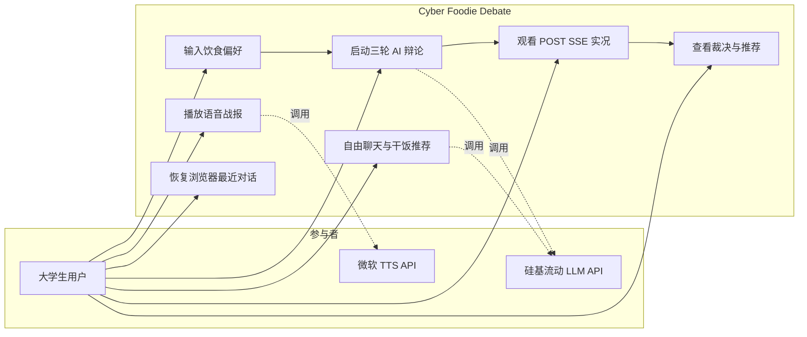
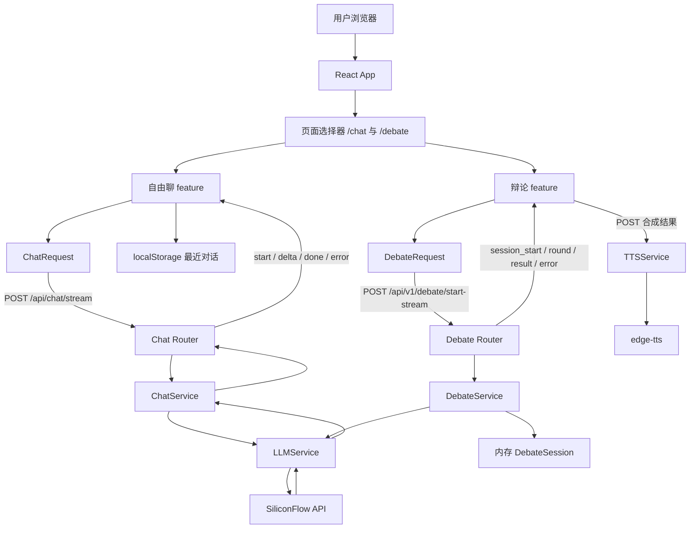
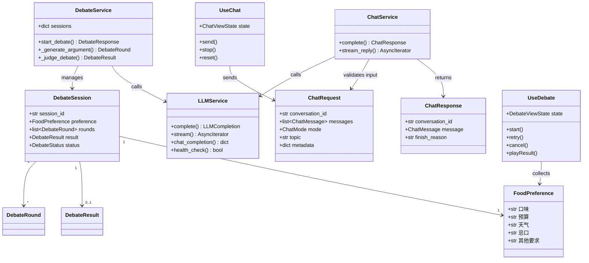
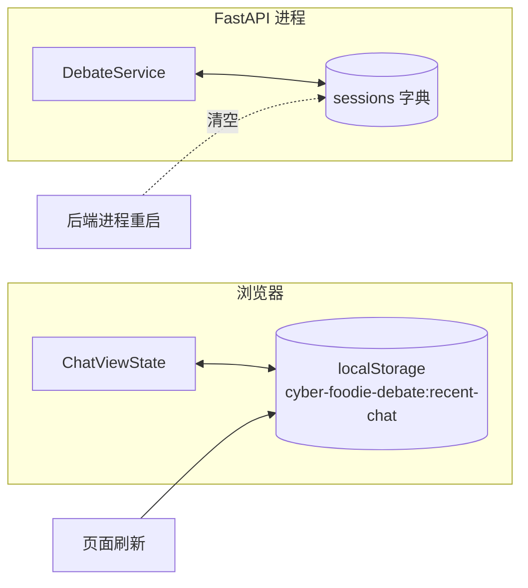
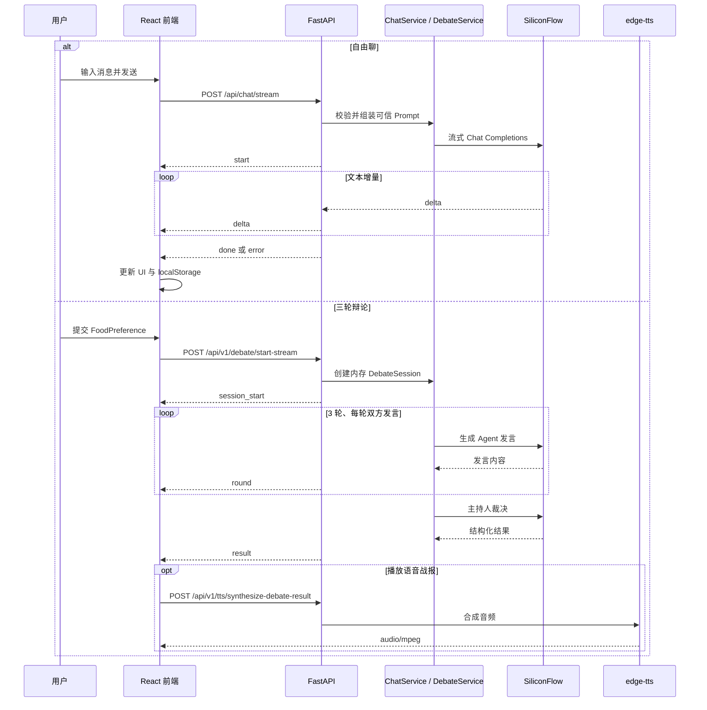
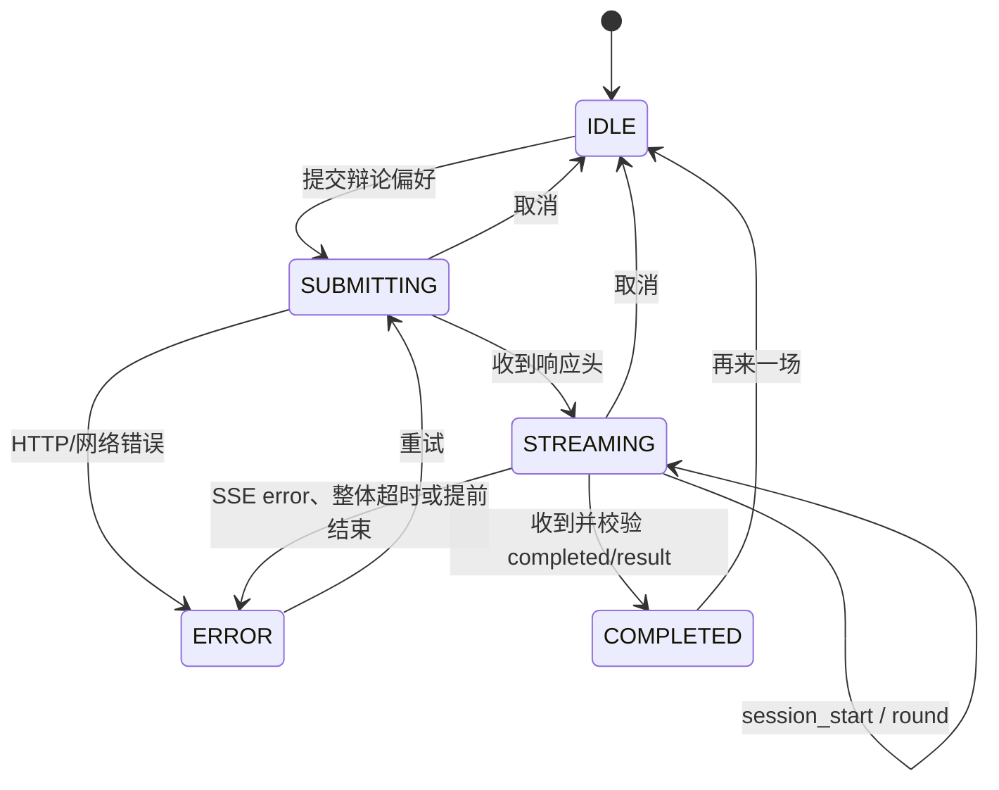

# 系统架构设计规约 — Cyber Foodie Debate

> 当前基线：React 19 + TypeScript + Vite 前端，FastAPI + Pydantic v2 后端。
> 本文描述当前已实现的运行时边界；数据库持久化仍属于后续工作。

---

## 一、功能模型 (Functional Model)

### 1. 系统顶层用例图 (Use Case Diagram)

### 2. 系统数据流图 (DFD)

前端只持有公开的后端地址。`SILICONFLOW_API_KEY` 仅由 FastAPI 服务读取，不得放入
任何会被 Vite 打包进浏览器的 `VITE_*` 环境变量。

---

## 二、数据与模块模型 (Data and Module Model)

### 3. 核心领域类图 (Domain Class Diagram)

后端 HTTP 输入和输出以 `src/backend/models.py` 中的 Pydantic Schema 为准；前端
对应类型位于 `src/frontend/src/types/`。接口变更必须同步修改两端类型和测试。

### 4. 当前存储模型 (Storage Model)

- 自由聊只保存最近一次浏览器会话，后端不持久化聊天消息。
- 辩论会话只保存在当前 FastAPI 进程内存中，进程重启后丢失。
- `conversation_id` 是后端持久化的扩展点，不代表当前已经接入数据库。

---

## 三、动态与行为模型 (Dynamic Model)

### 5. 端到端流式时序图 (System Sequence Diagram)

### 6. 前端交互状态机图 (State Diagram)

自由聊使用更小的 `idle -> streaming -> idle/error` 状态集。两个 feature 分别维护
状态，页面切换由 History API 驱动；生产静态服务器必须将 `/chat` 和 `/debate`
回退到 `index.html`。

---

## 四、开发与部署边界

- Vite 开发服务器默认监听 `127.0.0.1:5173`。
- FastAPI 默认监听 `0.0.0.0:8000`，Swagger UI 位于 `/docs`。
- 辩论 API 默认前缀为 `/api/v1`，聊天 API 默认前缀为 `/api`。
- 浏览器通过 `VITE_API_BASE_URL` 和 `VITE_CHAT_API_BASE_URL` 覆盖后端地址。
- 根目录 `Dockerfile` 构建 FastAPI 后端，`src/frontend/Dockerfile` 通过 pnpm 构建
  Vite 产物并交给 Nginx 托管。
- 容器前端使用相对 `/api` 地址，由 Nginx 反向代理后端，并为 History API 路由提供
  `index.html` 回退。
- Docker 健康检查只访问本地轻量存活接口，不调用真实 LLM 或 TTS。
- `DebateService` 对完整辩论设置整体超时；失败、超时和取消不会生成兜底成功结果。
- `LLMService` 同时限制进程内并发和每分钟上游调用数，超过本地频率限制时快速返回 429。
