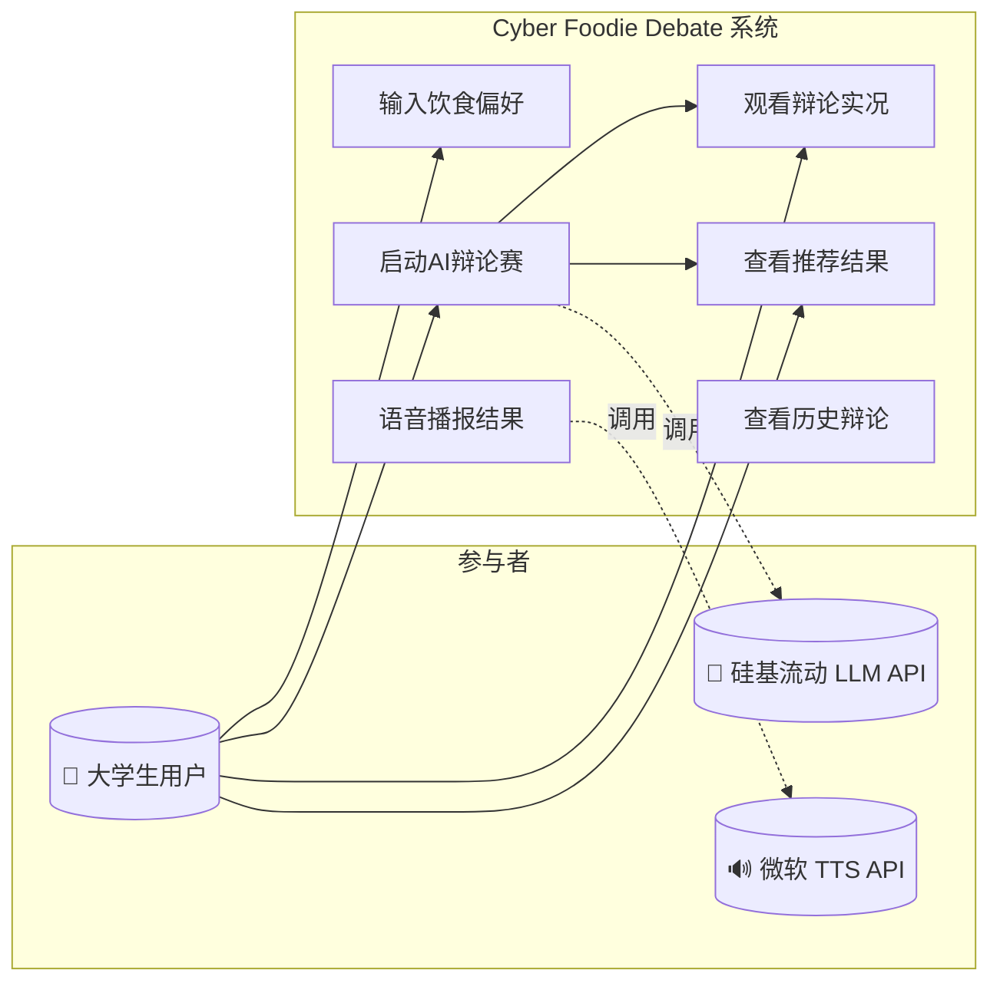
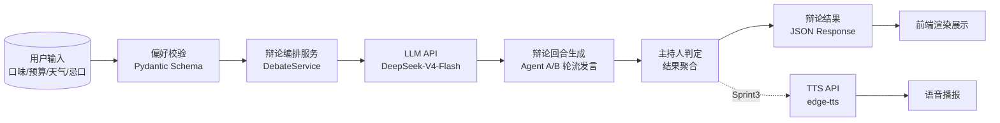
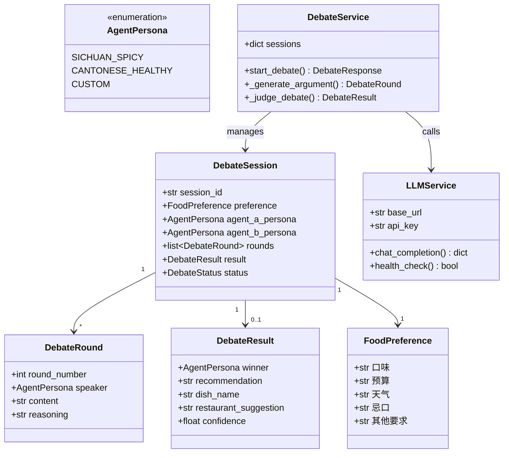
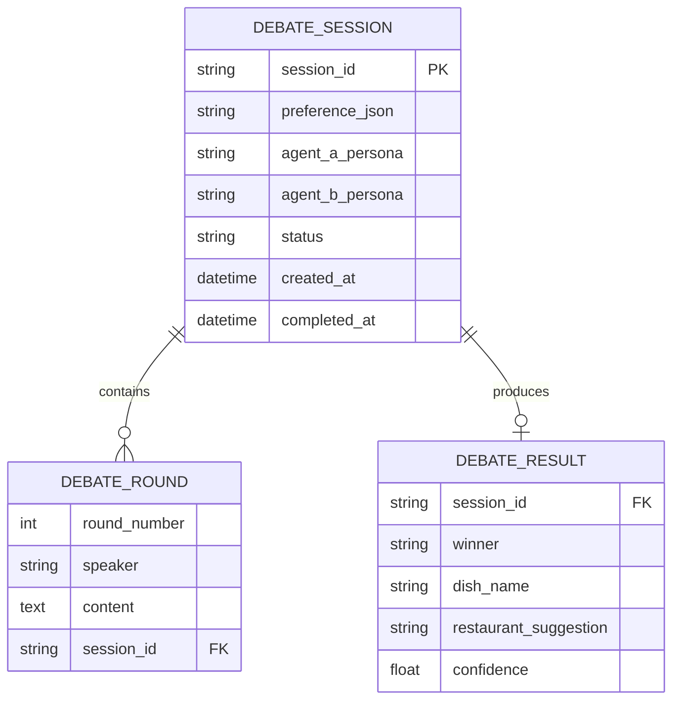
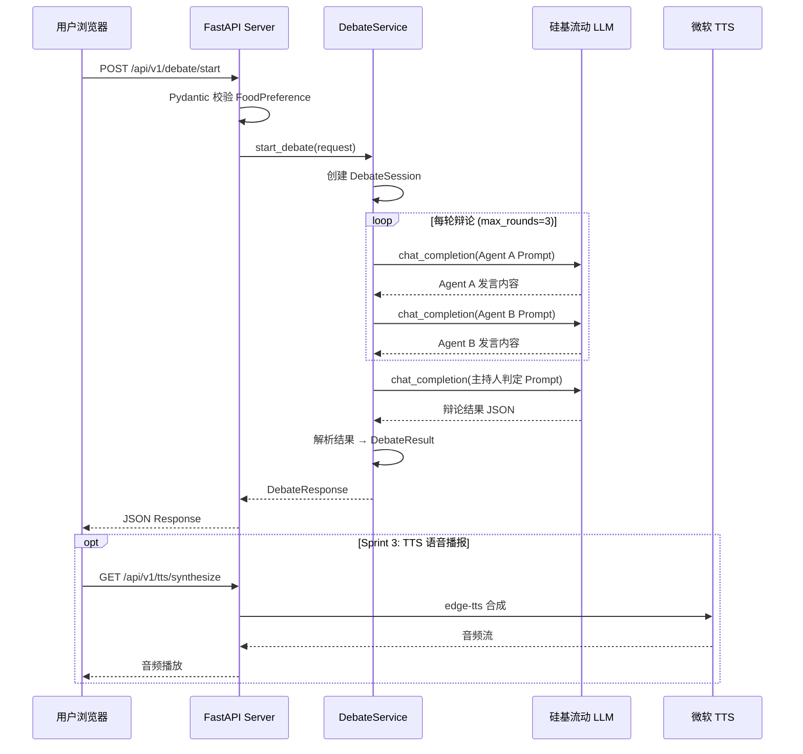
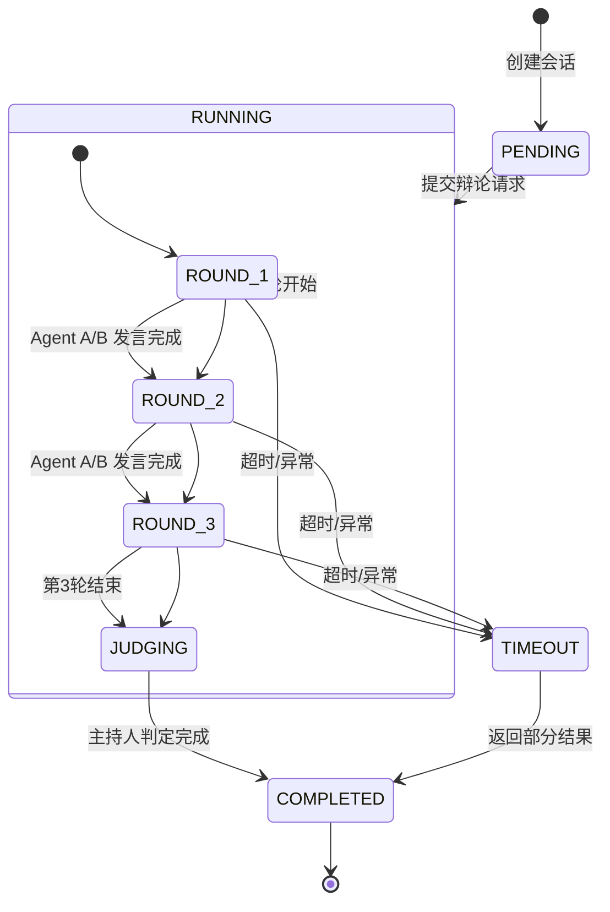

# 系统架构设计规约 — Cyber Foodie Debate

> 系统级三大模型（6大架构图）

---

## 一、功能模型 (Functional Model)

### 1. 系统顶层用例图 (Use Case Diagram)

### 2. 系统数据流图 (DFD)

---

## 二、数据模型 (Data Model)

### 3. 系统领域类图 (Domain Class Diagram)

### 4. 数据库实体关系图 (ER Diagram)

---

## 三、动态/行为模型 (Dynamic Model)

### 5. 端到端核心时序图 (System Sequence Diagram)

### 6. 系统生命周期状态机图 (State Diagram)

