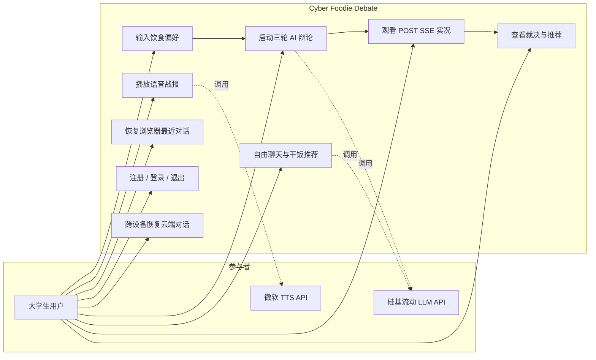
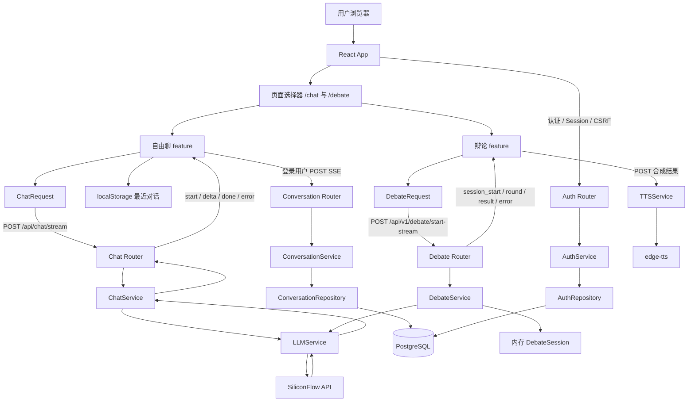
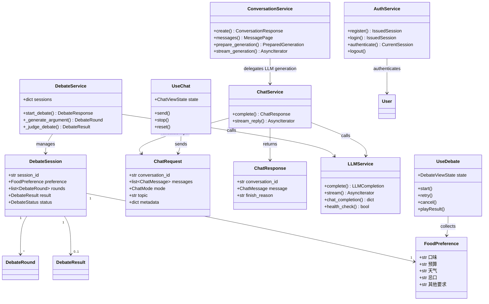
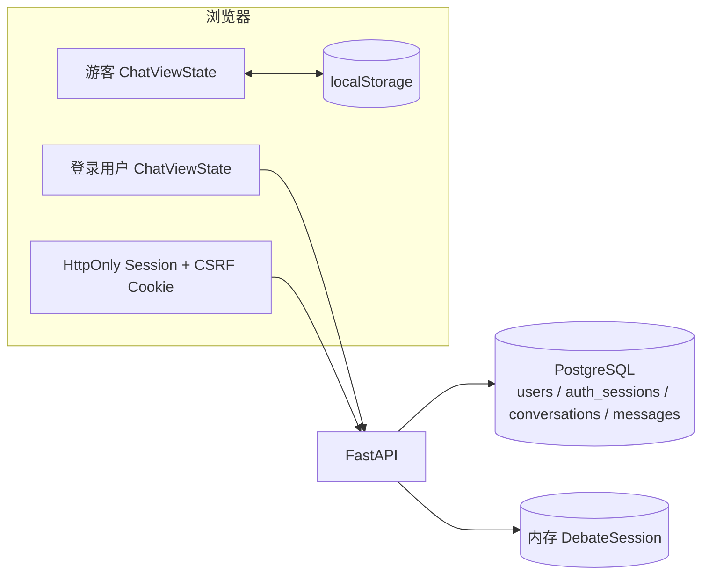
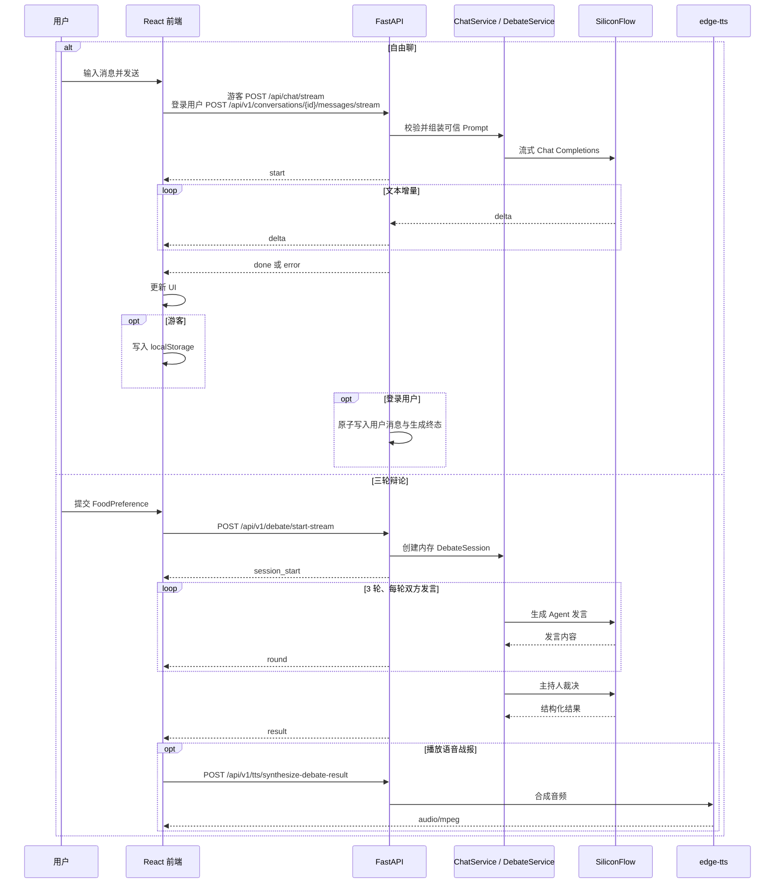
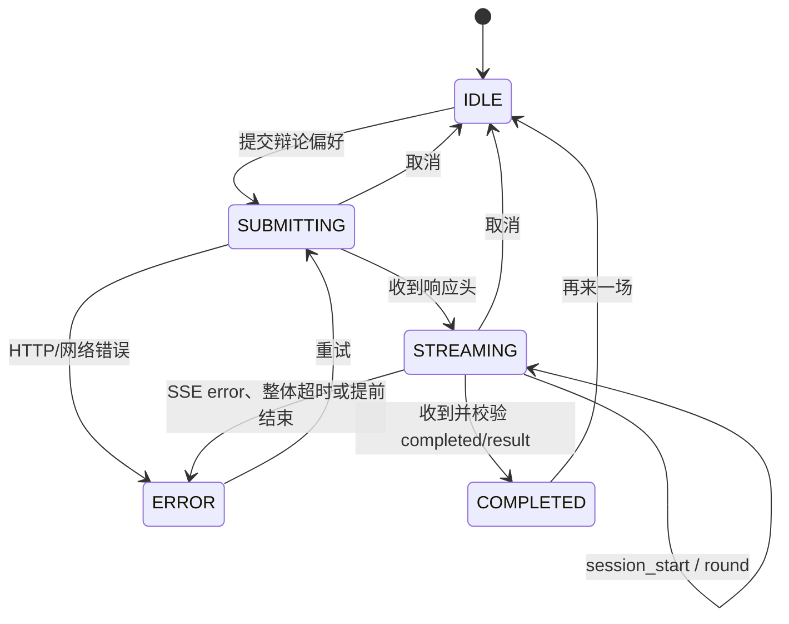

# 系统架构设计规约 — Cyber Foodie Debate

> 当前基线：React 19 + TypeScript + Vite 前端，FastAPI + Pydantic v2 后端。
> 本文描述当前已实现的运行时边界，包括第一方认证与 PostgreSQL 云端对话持久化。

---

## 一、功能模型 (Functional Model)

### 1. 系统顶层用例图 (Use Case Diagram)

### 2. 系统数据流图 (DFD)

前端只持有公开的后端地址。`SILICONFLOW_API_KEY` 仅由 FastAPI 服务读取，不得放入
任何会被 Vite 打包进浏览器的 `VITE_*` 环境变量。

---

## 二、数据与模块模型 (Data and Module Model)

### 3. 核心领域类图 (Domain Class Diagram)

后端 HTTP 输入和输出以 `src/backend/models.py` 中的 Pydantic Schema 为准；前端
对应类型位于 `src/frontend/src/types/`。接口变更必须同步修改两端类型和测试。

### 4. 当前存储模型 (Storage Model)

- 游客自由聊只保存最近一次浏览器会话；登录用户的会话和消息写入 PostgreSQL。
- 云端消息使用 `(conversation_id, sequence_no)` 排序并通过游标分页；前端恢复时仅请求最近 50 条。
- 认证使用 Argon2id 密码哈希和可撤销不透明 Session；数据库只存 Session/CSRF 哈希。
- 每个会话最多一个 `generating` 助手消息，唯一约束负责多实例并发互斥；失败、取消和过期生成均落终态。
- 辩论会话仍只保存在当前 FastAPI 进程内存中，进程重启后丢失。

---

## 三、动态与行为模型 (Dynamic Model)

### 5. 端到端流式时序图 (System Sequence Diagram)

### 6. 前端交互状态机图 (State Diagram)

自由聊使用更小的 `idle -> streaming -> idle/error` 状态集。两个 feature 分别维护
状态，页面切换由 History API 驱动；生产静态服务器必须将 `/chat` 和 `/debate`
回退到 `index.html`。

---

## 四、开发与部署边界

### 用户确认导入的事务与幂等

云端浏览：`GET /conversations/{id}/messages?limit=50&cursor=...` 返回按 sequence_no 正序的
最近一页及 next_cursor。后端 limit 范围仍为 1–100、默认 50，查询使用稳定序号边界。
前端不自动遍历游标；顶部按钮按次请求更早一页。只有校验和合并成功后才推进游标；
失败、重复/循环游标、无进展页、错误会话 ID 或冲突序号都保留已显示内容和原游标。
同 ID 去重、按序号排序；已完成的本地云端记录优先于迟到历史页中的旧内容。
初始加载、加载更早、SSE 生成分别维护状态与 AbortController，历史加载不提供停止生成。
切换用户、会话或卸载时取消旧请求。SSE 待生成消息与持久化历史独立保存，完成时按 ID 合并，
不使用发送前的历史数组覆盖新加载页。更早页到达后按可见消息 ID 恢复滚动位置。

前端 `LocalChatImport` 按 user ID 挂载并隔离状态。点击时捕获完整快照，使用
SHA-256(user ID + 本地会话 ID/模式/话题/更新时间/有序消息) 作为请求 ID；相同快照刷新后稳定，
不同用户及修订互不串用，不在浏览器新增认证数据。预览为纯文本且不发出正文网络请求。
POST 必须包含 `expected_user_id`（UUID），表示用户确认时的账号；服务端经过认证、Origin、
CSRF 校验后，写入前与认证 user ID 比对。不一致返回 `409 auth_identity_changed`，缺失返回 422，
不会进入导入服务。owner 始终取自服务端认证；该前置条件不参与原始内容指纹。
登录、注册、退出通过 localStorage 的随机 revision 通知其他标签页重新认证，事件不包含
用户资料、密码、Session/CSRF Token 或聊天正文。身份事件立即取消旧导入、分页和 SSE；
请求还比较仅保留在内存中的 CSRF Cookie 值与 revision，检测事件尚未送达的会话切换。
身份不明或变化时保留副本并提示重新确认，旧响应不导航、不清理、不更新新账号状态。
POST 后分别读取最近一页供聊天展示，以及调用 `POST /conversations/{id}/import/verify`
核对原始记录。核对请求使用相同的 `ConfirmedImportRequest`，同样经过认证、Origin、CSRF 和
expected_user_id 校验。先检查归属、原始 import_request_id 与不可变指纹，再仅查询序号
1–N（N 为原始快照条数，最多 50，SQL LIMIT N），逐条比较角色、正文、来源及完成状态。
响应 `ImportVerificationResponse` 包含 conversation_id、import_request_id、items（1–50 条原始消息）；
客户端复核这些字段及全部原始内容。核对不读取后续历史，也不随追加消息、改名而失效。
每次导入后最多 1 次核对（至多 50 条）和 1 次最近页读取（至多 50 条），不自动遍历游标。
指纹/请求 ID 不匹配返回 `409 import_conflict`，原始消息损坏返回 `409 import_verification_failed`；
未归属或已软删除的会话核对返回 404。重放导入的软删除语义仍是 `409 import_deleted`。
清理与游客存储写入共享 Web Locks，锁内再次检查会话变化和完整快照再移除，变化、存储失败
或不支持锁时保留。正确账号下已经提交但随后切换账号的导入无需撤销，可保留副本安全重试。
storage/custom event 同步当前游客内存；卸载及用户切换 abort，所有异步阶段检查取消信号。

`POST /api/v1/conversations/import` 沿 API → Service → Repository → Database 调用；
Router 复用登录、Origin、CSRF 依赖。请求模型在 `models.py`，限制见 README。
Service 对规范化 topic 和有序 messages 的确定性 JSON（键排序、无额外空格、UTF-8）
计算 SHA-256，不含预期账号、客户端请求 ID、服务端 ID 或时间。仅 topic 去首尾空白、空值转 null，
正文保留原始内容。

选择在 conversations 增加可空 `import_request_id`、`import_fingerprint`，以最小表结构
复用既有软删除生命周期；唯一约束 `uq_conversations_owner_import(user_id, import_request_id)`
保证并发最多一份。历史会话两个字段均为 null。新增迁移 `20260908_0002`，不修改旧迁移。
Repository 同事务创建会话和全部消息，先 flush 父记录再批量写消息，失败整体 rollback；
唯一冲突回滚后按用户及导入 ID 读取胜出事务结果。指纹只在初始导入写入，改名或追加不改它。
相同内容重放返回原会话；不同内容 `409 import_conflict`；软删除 `409 import_deleted`。

会话固定 chat、标题确定性截取首条 user 正文；消息编号从 1 连续递增，source 为
client_import、status 为 complete，时间为服务端带时区 UTC。导入无需配置或调用外部服务。
导入的两种角色仍是不可信历史；后续生成只由服务端模板创建 system 指令。

- Vite 开发服务器默认监听 `127.0.0.1:5173`。
- FastAPI 默认监听 `0.0.0.0:8000`，Swagger UI 位于 `/docs`。
- 辩论、认证和云端会话 API 默认前缀为 `/api/v1`，游客聊天 API 默认前缀为 `/api`。
- 浏览器通过 `VITE_API_BASE_URL` 和 `VITE_CHAT_API_BASE_URL` 覆盖后端地址。
- 根目录 `Dockerfile` 构建 FastAPI 后端，`src/frontend/Dockerfile` 通过 pnpm 构建
  Vite 产物并交给 Nginx 托管。
- 容器前端使用相对 `/api` 地址，由 Nginx 反向代理后端，并为 History API 路由提供
  `index.html` 回退。
- `FRONTEND_ORIGINS` 是允许携带凭据的浏览器来源 JSON 数组；HTTPS 部署必须同时设置
  `SESSION_COOKIE_SECURE=true`。Compose 从 `.env` 透传二者。
- Nginx 对登录/注册和其余 `/api/` 请求分别按客户端 IP 限流。
- Docker 健康检查只访问本地轻量存活接口，不调用真实 LLM 或 TTS。
- `DebateService` 对完整辩论设置整体超时；失败、超时和取消不会生成兜底成功结果。
- `LLMService` 同时限制进程内并发和每分钟上游调用数，超过本地频率限制时快速返回 429。
