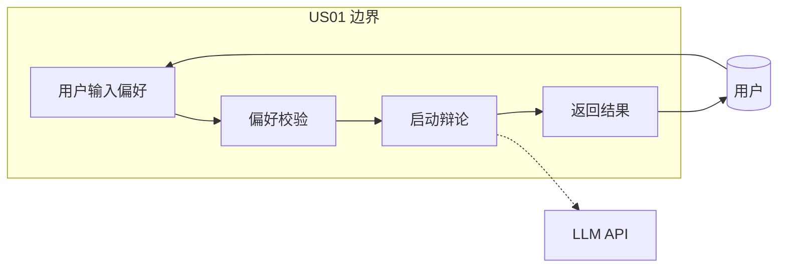
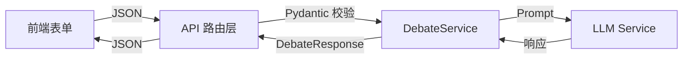
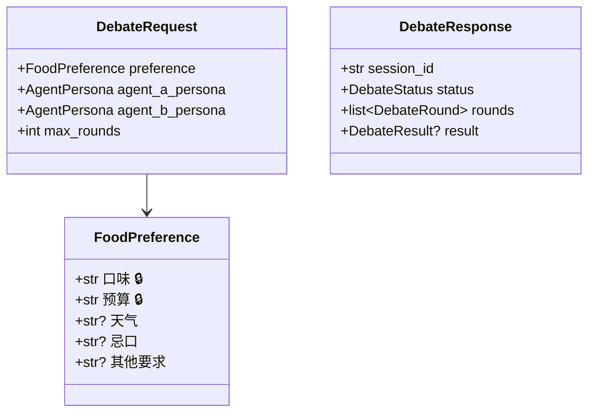
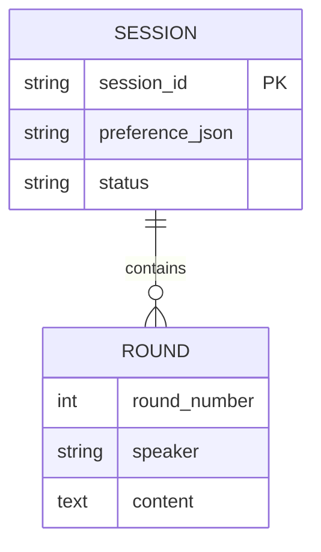
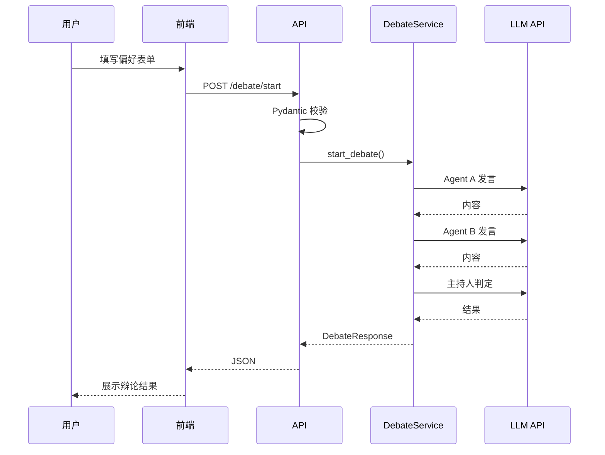
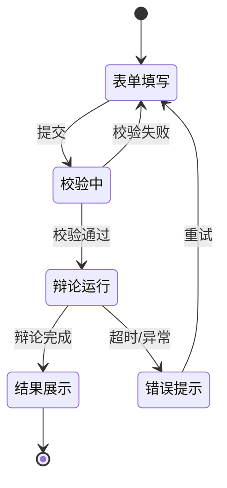

# US01 - 用户提交饮食偏好并启动辩论

## 故事卡片 (Card)

**作为** 一个纠结今天吃什么的大学生
**我想要** 输入我的口味偏好、预算和天气情况
**以便** 让两个AI大厨帮我辩论推荐今天吃什么

##  conversations (对话补充)
- 偏好字段：口味（必选）、预算（必选）、天气（可选）、忌口（可选）
- 支持5种口味预设 + 自定义输入
- 预算分4档：10元以下 / 10-20元 / 20-30元 / 30元以上

## Confirmation (验收标准 - Gherkin BDD)

```gherkin
Scenario: 正常提交偏好启动辩论
  Given 用户设置了口味为 "辣"
  And 用户设置了预算为 "10-20元"
  When 用户点击 "开始辩论"
  Then 系统应返回一场3轮辩论的结果
  And 结果应包含获胜方和推荐菜品

Scenario: 缺少必填字段
  Given 用户未设置预算
  When 用户点击 "开始辩论"
  Then 系统应返回 400 错误提示

Scenario: 忌口信息被正确处理
  Given 用户设置了忌口为 "海鲜过敏"
  When 辩论结束
  Then 推荐菜品不应包含海鲜类
```

---

## 故事级 6 图体系

### 图1：故事级用例/边界图



### 图2：故事级组件/数据流图



### 图3：故事级领域类与数据契约图



### 图4：故事级数据实体关系/持久化模型



### 图5：故事级端到端时序交互图



### 图6：故事级微观状态转换与活动流程图


