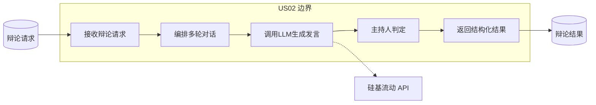
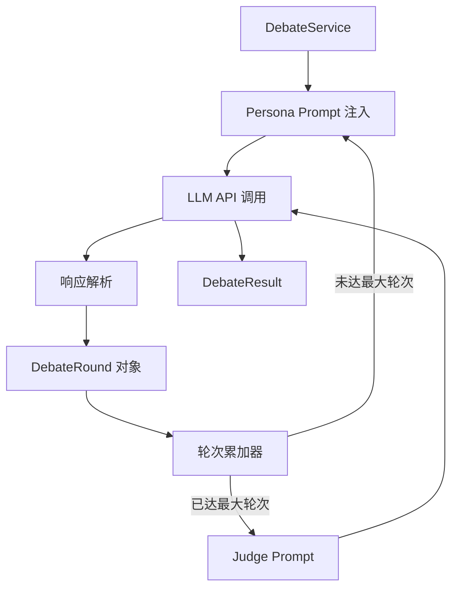
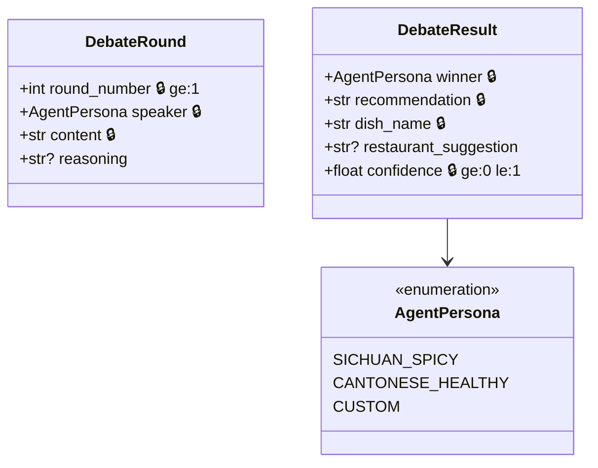
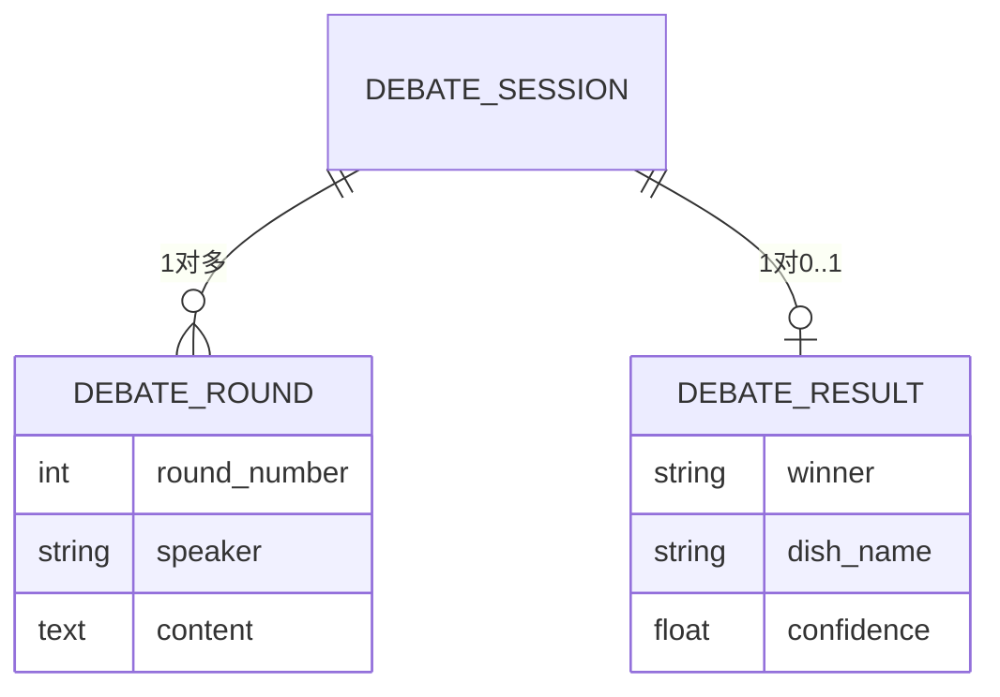
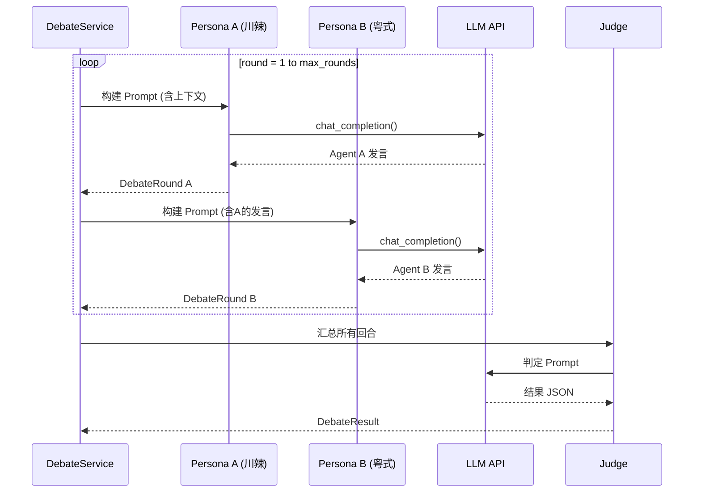
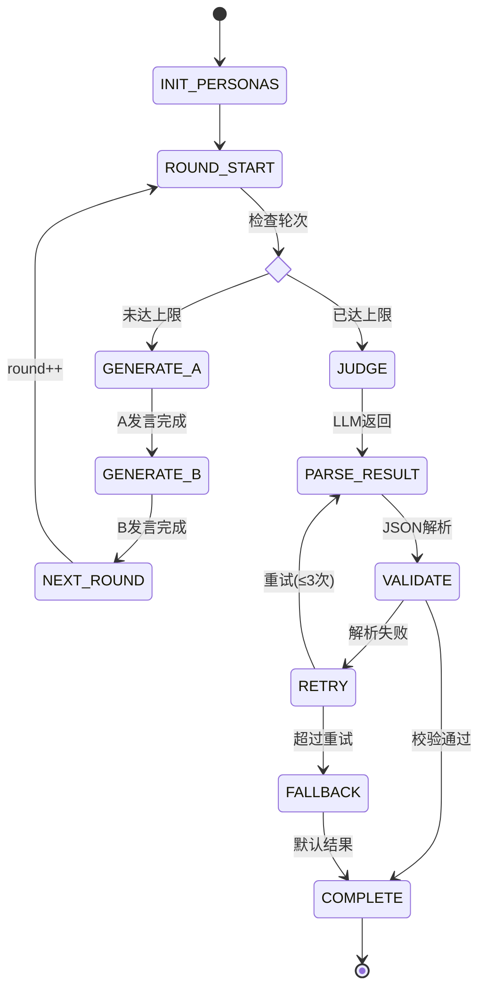

# US02 - 双Agent多轮辩论与结果判定

## 故事卡片 (Card)

**作为** 一个想看AI辩论表演的用户
**我想要** 两个不同性格的AI大厨进行多轮辩论
**以便** 在有趣的对抗中获得个性化的美食推荐

##  conversations (对话补充)
- Agent A：川辣派·老麻（豪爽火爆，无辣不欢）
- Agent B：粤式养生派·阿靓（温和儒雅，食补养生）
- 默认3轮辩论，支持1-5轮配置
- 每轮双方各发言一次，可互相反驳
- 最终由"主持人"判定获胜方

## Confirmation (验收标准 - Gherkin BDD)

```gherkin
Scenario: 标准3轮辩论
  Given 辩论已启动
  When 3轮辩论完成
  Then 应产生6条发言记录（每轮2条）
  And 每条发言应标注发言者和轮次

Scenario: 辩论结果判定
  Given 辩论已完成
  When 主持人进行判定
  Then 结果应包含获胜方
  And 结果应包含推荐菜品名称
  And 结果应包含0-1之间的置信度

Scenario: 辩论超时处理
  Given LLM API 响应超时
  When 重试3次后仍失败
  Then 系统应返回部分辩论结果
  And 状态标记为 timeout
```

---

## 故事级 6 图体系

### 图1：故事级用例/边界图



### 图2：故事级组件/数据流图



### 图3：故事级领域类与数据契约图



### 图4：故事级数据实体关系/持久化模型



### 图5：故事级端到端时序交互图



### 图6：故事级微观状态转换与活动流程图


