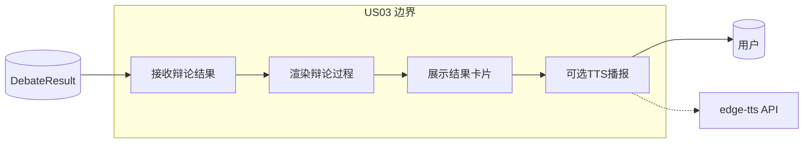
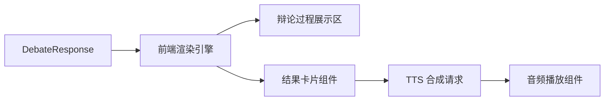
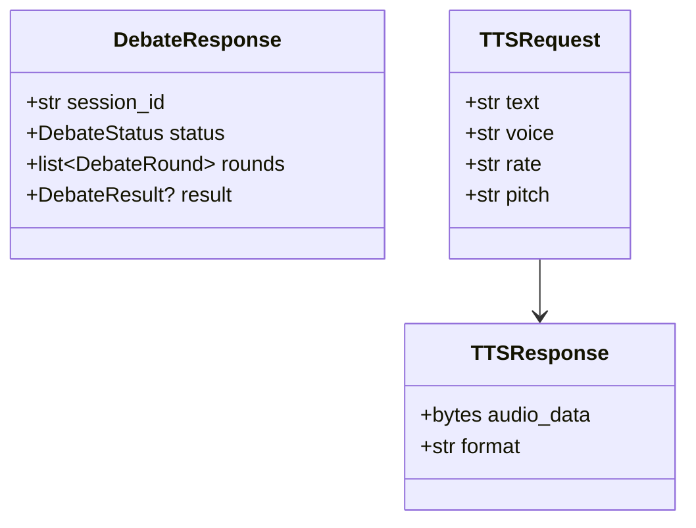
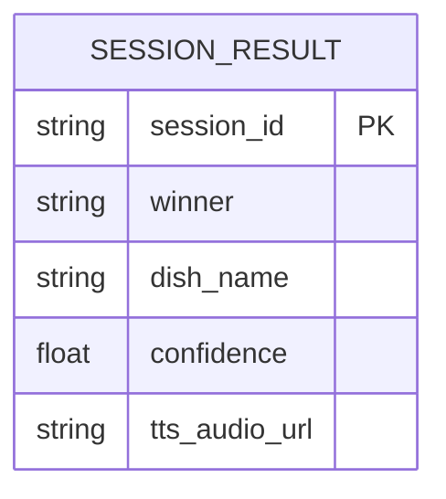
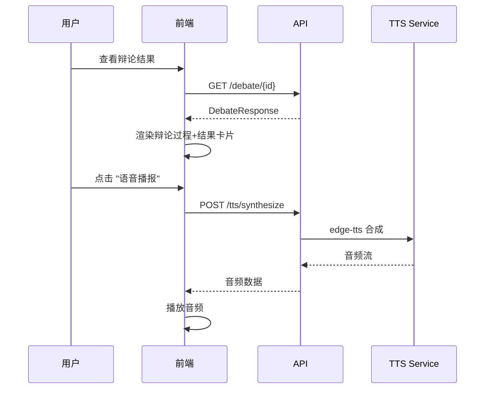
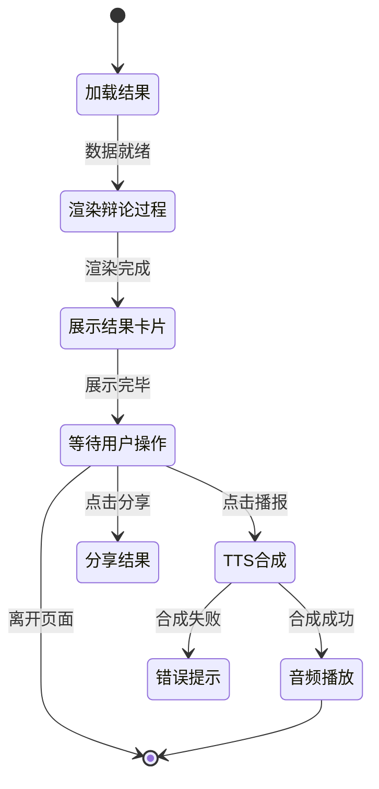

# US03 - 辩论结果展示与语音播报 (Sprint 3)

## 故事卡片 (Card)

**作为** 一个想看辩论结果的用户
**我想要** 以可视化的方式查看辩论过程和最终推荐
**以便** 获得有趣且实用的美食决策参考

##  conversations (对话补充)
- 辩论过程实时展示（Sprint 3: SSE 流式）
- 结果卡片展示：获胜方 + 推荐菜品 + 置信度
- TTS 语音播报辩论结果（Sprint 3）
- 支持结果分享/导出

## Confirmation (验收标准 - Gherkin BDD)

```gherkin
Scenario: 辩论结果可视化展示
  Given 一场辩论已完成
  When 用户查看结果页面
  Then 应展示双方辩论内容
  And 应高亮显示获胜方
  And 应展示推荐菜品和置信度

Scenario: TTS语音播报结果
  Given 辩论已完成且TTS服务可用
  When 用户点击 "语音播报"
  Then 系统应播放辩论结果摘要
  And 语音应使用微软 edge-tts 中文语音

Scenario: 结果置信度展示
  Given 辩论结果置信度为 0.85
  When 展示结果
  Then 置信度应显示为 "85%"
```

---

## 故事级 6 图体系

### 图1：故事级用例/边界图



### 图2：故事级组件/数据流图



### 图3：故事级领域类与数据契约图



### 图4：故事级数据实体关系/持久化模型



### 图5：故事级端到端时序交互图



### 图6：故事级微观状态转换与活动流程图


